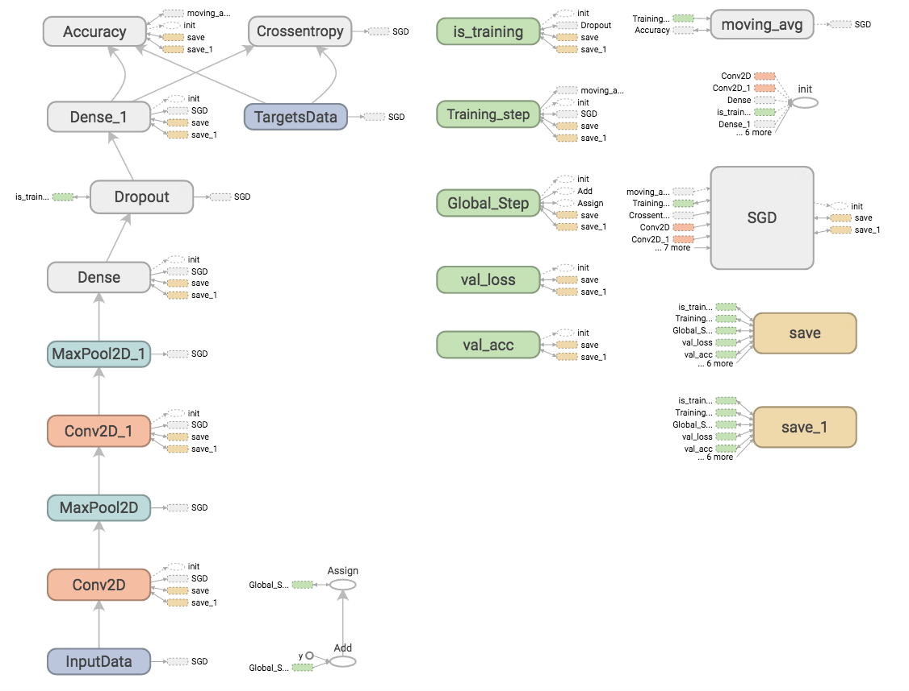
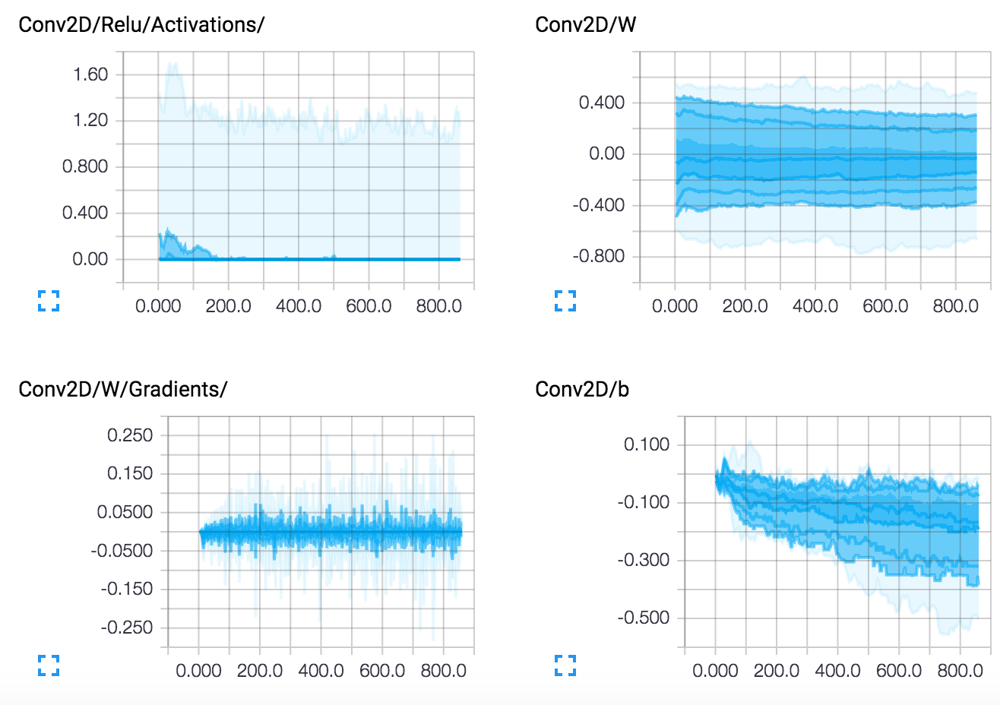

[](https://travis-ci.org/tflearn/tflearn)
[](https://badge.fury.io/py/tflearn)
[](LICENSE)
[](https://gitter.im/tflearn/tflearn?utm_source=badge&utm_medium=badge&utm_campaign=pr-badge&utm_content=badge)

# TFLearn: Deep learning library featuring a higher-level API for TensorFlow.

TFlearn is a modular and transparent deep learning library built on top of Tensorflow.  It was designed to provide a higher-level API to TensorFlow in order to facilitate and speed-up experimentations, while remaining fully transparent and compatible with it.

TFLearn features include:

- Easy-to-use and understand high-level API for implementing deep neural networks, with tutorial and examples.
- Fast prototyping through highly modular built-in neural network layers, regularizers, optimizers, metrics...
- Full transparency over Tensorflow. All functions are built over tensors and can be used independently of TFLearn.
- Powerful helper functions to train any TensorFlow graph, with support of multiple inputs, outputs and optimizers.
- Easy and beautiful graph visualization, with details about weights, gradients, activations and more...
- Effortless device placement for using multiple CPU/GPU.

The high-level API currently supports most of recent deep learning models, such as Convolutions, LSTM, BiRNN, BatchNorm, PReLU, Residual networks, Generative networks... In the future, TFLearn is also intended to stay up-to-date with latest deep learning techniques.

Note: This is the first release of TFLearn. Contributions are more than welcome!

## Overview
```python
# Classification
tflearn.init_graph(num_cores=8, gpu_memory_fraction=0.5)

net = tflearn.input_data(shape=[None, 784])
net = tflearn.fully_connected(net, 64)
net = tflearn.dropout(net, 0.5)
net = tflearn.fully_connected(net, 10, activation='softmax')
net = tflearn.regression(net, optimizer='adam', loss='categorical_crossentropy')

model = tflearn.DNN(net)
model.fit(X, Y)
```

```python
# Sequence Generation
net = tflearn.input_data(shape=[None, 100, 5000])
net = tflearn.lstm(net, 64)
net = tflearn.dropout(net, 0.5)
net = tflearn.fully_connected(net, 5000, activation='softmax')
net = tflearn.regression(net, optimizer='adam', loss='categorical_crossentropy')

model = tflearn.SequenceGenerator(net, dictionary=idx, seq_maxlen=100)
model.fit(X, Y)
model.generate(50, temperature=1.0)
```

There are many more examples available *[here](http://tflearn.org/examples)*.

## Installation

**TensorFlow Installation**

TFLearn requires Tensorflow (version >= 0.11) to be installed: *[Tensorflow installation instructions](https://github.com/tensorflow/tensorflow/blob/master/tensorflow/g3doc/get_started/os_setup.md)*.

**TFLearn Installation**

To install TFLearn, the easiest way is to run

For the bleeding edge version (recommended):
```python
pip install git+https://github.com/tflearn/tflearn.git
```
For the latest stable version:
```python
pip install tflearn
```
Otherwise, you can also install from source by running (from source folder):
```python
python setup.py install
```

- For more details, please see the *[Installation Guide](http://tflearn.org/installation)*.

## Getting Started

See *[Getting Started with TFLearn](http://tflearn.org/getting_started)* to learn about TFLearn basic functionalities or start browsing *[TFLearn Tutorials](http://tflearn.org/tutorials)*.

## Examples

There are many neural network implementation available, see *[Examples](http://tflearn.org/examples)*.

## Documentation

[http://tflearn.org/doc_index](http://tflearn.org/doc_index)

## Model Visualization

**Graph**



**Loss & Accuracy (multiple runs)**


**Layers**



## Contributions

This is the first release of TFLearn, if you find any bug, please report it in the GitHub issues section.

Improvements and requests for new features are more than welcome! Do not hesitate to twist and tweak TFLearn, and send pull-requests.

For more info: *[Contribute to TFLearn](http://tflearn.org/contributions)*.

## License

MIT License
# Tensorflow_learn
 
 
 
 
 
 
 
 
 
 
 
 
 
 
 
 
 
 
 
 
 
 
 
 
 
 
 
 
 
 
 
 
 
 
 
 
 
 
 
 
 
 
